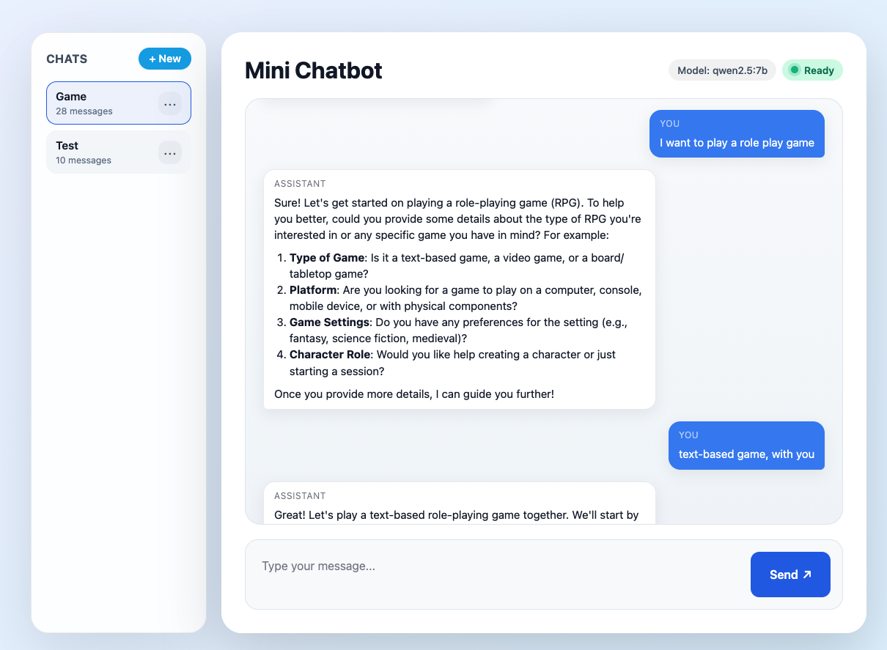

# Mini Chatbot

A minimal web chat UI backed by a Node.js proxy that streams requests to a locally running Ollama instance (e.g., `qwen2.5`) while persisting users, sessions, and full conversation history in SQLite.




## Prerequisites

- [Node.js 18+](https://nodejs.org/)
- [Ollama](https://ollama.ai/) with `ollama serve` running locally
- Qwen model pulled locally, e.g. `ollama pull qwen2.5`

## Getting Started

1. Install dependencies:

   ```bash
   npm install
   ```

2. Ensure the Ollama daemon is running and the desired model is available:

   ```bash
   ollama serve
   ```

3. Start the web server:

   ```bash
   npm start
   ```

4. Visit [http://localhost:3000](http://localhost:3000). On first load you’ll be prompted to choose a username (a handle is stored locally). From there you can create/manage sessions and start chatting.

> The SQLite database lives at `data/chat.sqlite` (ignored by git). Delete this file if you want a clean slate.

## Environment Variables

| Name | Default | Description |
| --- | --- | --- |
| `PORT` | `3000` | Port for the Express server. |
| `OLLAMA_CHAT_URL` | `http://localhost:11434/api/chat` | Endpoint for the local Ollama chat API. |
| `OLLAMA_MODEL` | `qwen2.5` | Model identifier passed to Ollama. |

## Features & Flow

- **Persistent chat history** – Every message is stored centrally (SQLite + better-sqlite3) under a user/session, so conversations survive refreshes and can resume on any device that knows the user handle.
- **Multiple sessions per user** – Users can spin up as many chats as they want, rename them, and delete them; each session history is loaded on demand via REST endpoints.
- **Streaming proxy to Ollama** – `/api/chat` rebuilds the prompt from stored history, streams NDJSON deltas from Ollama to the browser, and aborts upstream work if the client disconnects.
- **Handle-based identities** – Instead of full auth, users choose a memorable username. The backend enforces session ownership via `{ userId, sessionId }`, and clients can log out to switch identities.

Feel free to extend this further (e.g., auth, RAG, summarization, rate limiting).
