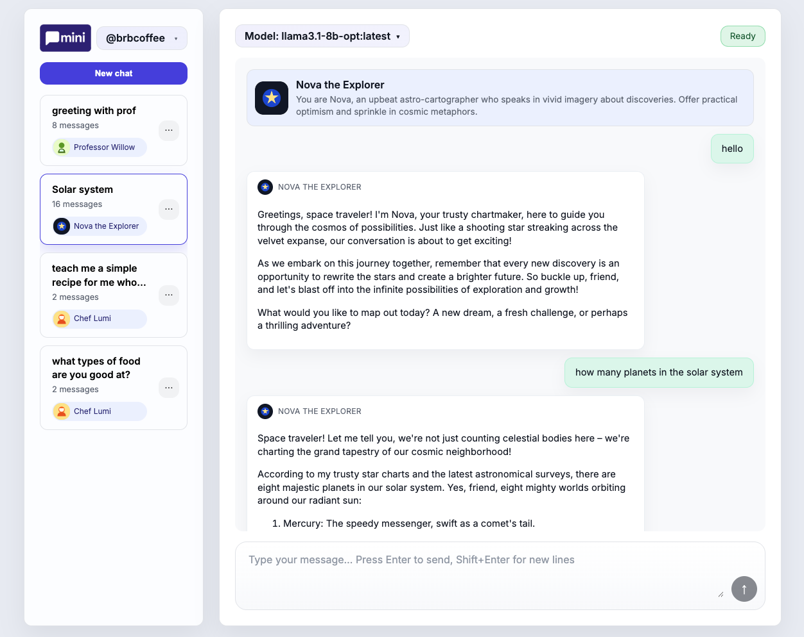

<p align="center">
   
</p>

**Mini** is a character chatbot powered by your favorite local LLMs. It uses a React frontend, an Express backend, and an Ollama-based LLM facade. As its name suggests, it supports a minimal feature set designed to be extended for more complex use cases later on

- character marketplace
- conversation session management
- message sharing
- user management




## Prerequisites

- [Node.js 18+](https://nodejs.org/)
- [Ollama](https://ollama.ai/) with `ollama serve` running locally
- LLM models pulled locally, e.g. `ollama pull qwen2.5`

## Getting Started

1. Install dependencies:

   ```bash
   npm install
   npm --prefix client install
   ```

2. Build the React frontend so the Express server can serve it:

   ```bash
   npm --prefix client run build
   ```

3. Ensure the Ollama daemon is running and the desired model is available:

   ```bash
   ollama serve
   ```

4. Start the web server:

   ```bash
   npm start # to run the service

   LOG_LEVEL=debug npm run dev # for local development
   ```

5. Visit [http://localhost:3000](http://localhost:3000). On first load you’ll be prompted to choose a username (a handle is stored locally). From there you can create/manage sessions and start chatting.


### Local development tips
- Use `npm --prefix client run dev` for a hot-reloading React dev server (it proxies API calls to `localhost:3000`). Run `npm start` separately so the backend is available.
- Running `npm --prefix client run build` again will refresh the production bundle that Express serves.
- `LOG_LEVEL=debug npm run dev` is handy when you want to rebuild the client and restart the server without typing two commands.

## Linting & Testing

### Backend
```bash
# to lint the backend code
npm run lint
# to lint both backend and frontend
npm run lint:all

# to run tests
npm test
```
### Frontend
```bash
# to lint the frontend code
npm run lint:client
# to lint both backend and frontend
npm run lint:all

# to run tests
npm --prefix client run test
# or
npm run test:client
```

## Environment Variables

| Name | Default | Description |
| --- | --- | --- |
| `PORT` | `3000` | Port for the Express server. |
| `OLLAMA_CHAT_URL` | `http://localhost:11434/api/chat` | Endpoint for the local Ollama chat API. |
| `OLLAMA_MODEL` | `qwen2.5` | Model identifier passed to Ollama. |

## Features & Flow

- **Persistent chat history** – Every message is stored centrally (SQLite + better-sqlite3) under a user/session, so conversations survive refreshes and can resume on any device that knows the user handle.
- **Multiple sessions per user** – Users can spin up as many chats as they want, rename them, and delete them; each session history is loaded on demand via REST endpoints.
- **Character marketplace** – Each user can create and publish characters (name + background + avatar). Sessions can be associated with a specific persona (or none), and the persona prompt is injected automatically so the assistant replies in-character. 
- **Streaming proxy to Ollama** – `/api/chat` rebuilds the prompt from stored history, streams NDJSON deltas from Ollama to the browser, and aborts upstream work if the client disconnects.

Feel free to extend this further (e.g., auth, RAG, summarization, rate limiting).

## License
MIT