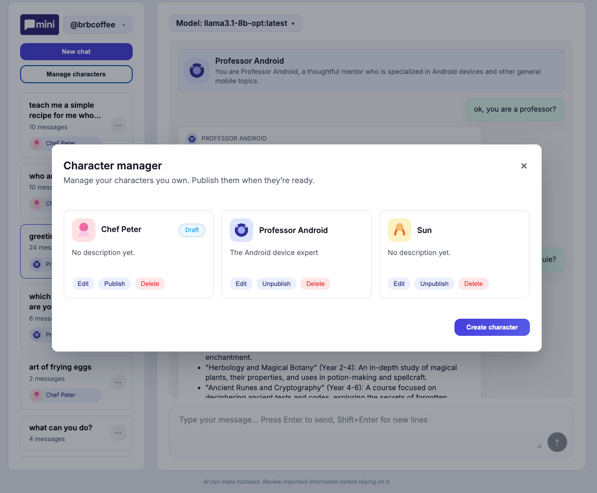
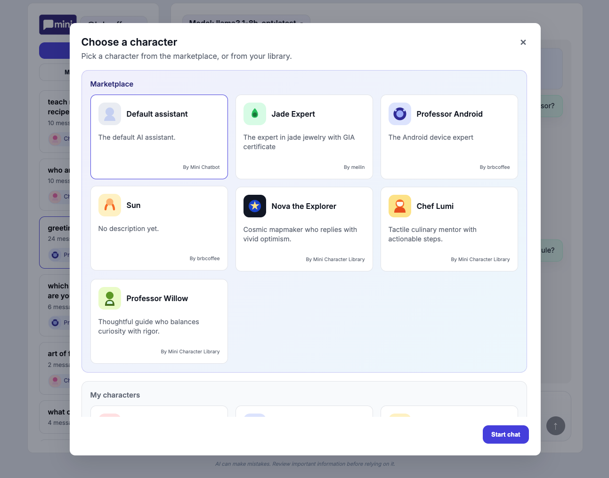

# Character Marketplace / Shared Personas

## Problem to Solve
- Fragmented personas lived inside each user account, so edits required copy/paste and other users never received updates.
- Users could create and edit characters inside the picker, which mixed “start chat” flow with persona authoring and led to conflicting UX expectations.
- No single source of truth for ownership and publish state; everyone could effectively clone “Chef Lumi” and modify it independently.
- Marketplace/library distinction was unclear, so default assistant, drafts, and published personas blended together.

## Features Implemented
- **Centralized characters** persisted once with `owner_user_id`, `status`, `short_description`, `avatar_url`, etc.; sessions reference the shared `character_id`.
- **Character picker as unified launcher** showing default assistant, marketplace personas, and the user’s own drafts/published characters in one grid (no editing, no pin/unpin).
- **Dedicated character manager** modal listing only owned personas with edit, publish/unpublish, and delete actions plus right-aligned “Create character” CTA.
- **Owner metadata surfaced** on cards (“By username”) and every edit flow enforces ownership, while marketplace cards remain read-only.
- **Consistent visual system**: both picker and manager reuse the same card component, state badges, hover lift, and marketplace highlighting.

## Technical Architecture Diagram
```
┌─────────────┐        HTTPS        ┌────────────────────────┐
│   Browser   │  fetch/list/manage  │  Express/Node backend  │
│(Picker/UI)  │ ───────────────────▶│  /characters APIs      │
└─────┬───────┘                     └──────────┬─────────────┘
      │                                      CRUD / publish
      │                                      │
      ▼                                      ▼
┌─────────────┐       owns/edits      ┌──────────────────────┐
│Character    │◀──────────────────────│characters table      │
│Manager      │                       │id, owner_user_id,    │
│(owned only) │                       │status, prompt, meta… │
└─────┬───────┘                       └──────────┬───────────┘
      │                                         references
      │ selects                                 │
      ▼                                         ▼
┌─────────────┐                         ┌────────────────────┐
│Character    │  provides character id  │sessions.character_id│
│Picker modal │────────────────────────▶│and chat execution   │
└─────────────┘                         └────────────────────┘
```

## Key Decisions
- Characters live in their own table and are referenced by ID; we never duplicate or snapshot prompts when users start chats.
- Publishing is an explicit owner-only action; marketplace entries are just published rows, and the default assistant appears as the first marketplace card.
- Picker is purely for selection—no creation, editing, or pinning—while the manager is the single place to author personas.
- Default assistant, marketplace characters, and personal drafts are visually differentiated but rendered via the same card layout to keep consistency.
- Pin/unpin is intentionally removed in this iteration to reduce complexity; users can start chats directly from any published persona or their own drafts.

## Screenshots


