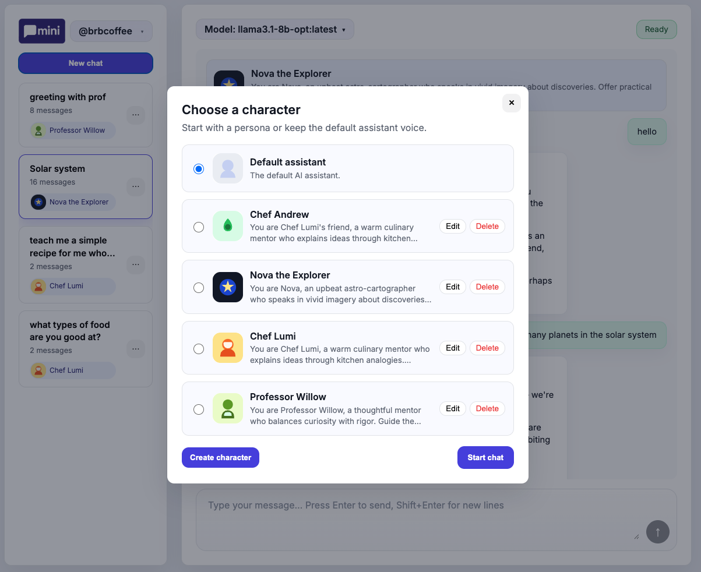
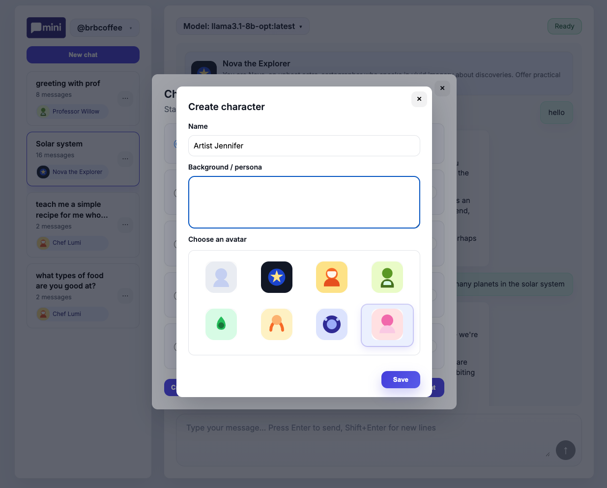

# Character Persona System

## Feature Set
- Users can create characters (name, background prompt, optional avatar) and reuse them across sessions.
- A single picker (invoked from `+ New`) lets you select an existing character, create a new one inline, or start with “No character.”
- Sessions remember the chosen character; each chat loads that persona automatically and shows a banner/avatar in the transcript.
- Characters can be edited or deleted; sessions referencing a deleted persona fall back to the default assistant.
- Three seed characters (Nova, Chef Lumi, Professor Willow) with bundled SVG avatars are created for every user.

## Architecture
```
┌────────────┐     REST      ┌──────────────┐     SQLite (better-sqlite3)   ┌───────────┐
│  Browser   │ ────────────► │ Express API  │ ─────────────────────────────►│ users     │
│ (picker UI)│ ◄──────────── │  server.js   │ ◄──────────────────────────── │ characters│
└────────────┘  start chat   └──────────────┘  per-user character tables    │ sessions  │
        │                         │                                         └───────────┘
        │                         │ HTTP keep-alive                           │ Ollama
        │ start chat              │                                           ▼
        └────────────────────────►                                  prompts prepended
```
- **Browser**: only needs the picker modal and lightweight REST calls (`GET/POST/PATCH/DELETE /api/characters`, `POST /api/sessions`). No persona logic lives in local storage aside from the selected ID and avatar thumbnail.
- **Express API**: stores characters per user, exposes CRUD endpoints, and ensures `/api/chat` prepends the persona prompt as a `system` message before proxying to Ollama.
- **SQLite**: `users`, `characters`, `sessions`, `messages` tables. `sessions.character_id` references the selected persona; foreign keys keep data consistent.
- **Ollama**: sees the persona prompt + conversation history; nothing changes downstream except the initial system message.

## Key Decisions
- **Server-authoritative personas**: keeping prompts on the backend avoids trusting arbitrary text from the browser and lets us inject them consistently when `/api/chat` runs.
- **Seed data**: shipping three starter personas (with avatars) gives every user something to try and reduces the empty-state work in the picker.
- **Single picker modal**: instead of multiple UI entry points, every chat starts via one selector that doubles as a management surface. The UI shows one list with radio-style selection, inline edit/delete, and a single “Start chat” CTA.
- **Prompt injection**: persona text is stored verbatim and added as `[{ role: 'system', content: prompt }]` ahead of the chat history, so downstream code doesn’t need to know about characters.
- **Graceful fallbacks**: if a persona is deleted, sessions referencing it are updated to `NULL` so `/api/chat` falls back to the default assistant without errors.


## Screenshots



