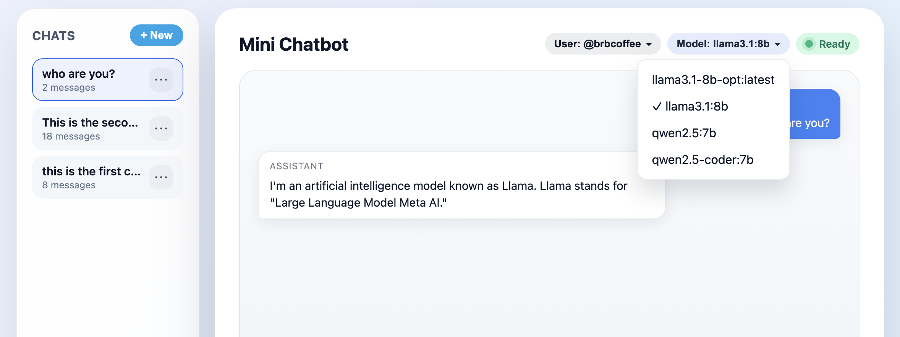

# Model Picker Design

## Problem Statement

Users can now persist chats and resume them from any browser, but they were still locked to the single model configured via `OLLAMA_MODEL`. Changing models required editing environment variables or restarting the server, and the UI gave no insight into which models were even available. We needed:

1. A way to discover the models currently pulled on the Ollama host and expose them to the browser.
2. Per-user persistence, so each handle sticks with their last-selected model across refreshes/logins, while still falling back when a model disappears.
3. An in-app control (next to the status/model badges) so any user can switch models without touching the server.

## Architecture Summary

```
┌────────────┐        HTTPS          ┌──────────────┐    HTTP keep-alive     ┌───────────┐
│  Browser   │ ───────────────────►  │  Express API │ ─────────────────────► │  Ollama   │
│ (Model UI) │ ◄───────────────────  │  server.js   │ ◄───────────────────── │  /api/tags│
└────────────┘  /api/models, chat    └──────────────┘  cached model list     └───────────┘
                              │
                              │ SQLite
                              ▼
                         ┌─────────────────┐
                         │ users table     │
                         │ preferred_model │
                         └─────────────────┘
```

- **Discovery**: the server hits `OLLAMA_TAGS_URL` (e.g., `http://localhost:11434/api/tags`), caches the list for 15s, and exposes it via `GET /api/models?userId=…`. The response also contains the selected model (user preference or fallback).
- **Preference update**: `PATCH /api/users/:userId/model` validates the requested model against the cached list and updates `preferred_model` in SQLite. `/api/chat` uses the stored value (or default/fallback) when calling Ollama.
- **Frontend**: the header’s model pill becomes a button that opens a dropdown listing all available models. Choosing one calls the PATCH endpoint, updates local storage, and closes the menu.

## Key Decisions

- **Database migration (non-breaking)**: we add `preferred_model TEXT` to `users` via `PRAGMA table_info` detection so existing DBs get the column without manual SQL.
- **Cached discovery**: direct calls to `/api/tags` can be slow; caching reduces latency and load while keeping options reasonably fresh.
- **Graceful fallback**: when a user’s preferred model disappears, `/api/models` automatically resets to the default (`OLLAMA_MODEL`) or the first available entry and persists the change, so `/api/chat` never fails because of stale preferences.
- **Client persistence**: the browser still stores only `{ userId, username, preferredModel }` and the active session id. Logging out clears the preferred model, ensuring the next user starts clean.

## Screenshots
