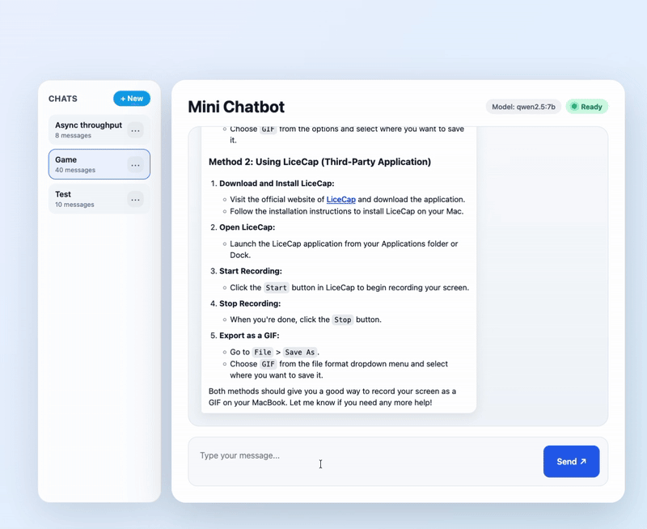
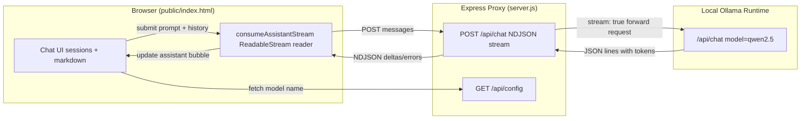

# Streaming Implementation Notes

## Overview
- `/api/chat` now proxies Ollama’s streaming responses so the browser receives tokens as NDJSON chunks instead of waiting for a full JSON payload.
- The chat UI consumes those chunks, updates the active assistant bubble word by word, and keeps client-side conversation history in sync with the incremental reply.

## Backend Highlights (`server.js`)
- Requests include `stream: true`, and the Express handler relays Ollama’s readable stream directly to the client.
- Each upstream JSON line is decoded and normalized into `delta`, `error`, or `done` events that are written as NDJSON with chunked encoding headers (`application/x-ndjson`, `no-cache`, `keep-alive`).
- Non-stream scenarios are still handled: failures before headers return a 500 JSON error, while mid-stream issues emit an `error` event before closing the response.

## Frontend Highlights (`public/index.html`)
- A new `consumeAssistantStream` helper reads the `ReadableStream`, parses every newline-delimited JSON chunk, and feeds deltas back to the submit handler.
- The submit handler now creates a placeholder assistant message, updates its markdown-rendered body as deltas arrive, persists the final text, and preserves existing session management.
- `scrollConversationToBottom()` keeps the viewport pinned to the newest content on every update so streaming feels live.

## Architecture Diagram

## UI Enhancements
- While waiting for the first delta, the assistant bubble shows a pulsing three-dot “thinking” indicator (`.message.assistant.is-thinking`) so the user sees immediate feedback even if the model pauses before replying.
- Once tokens arrive—or an error/empty response is detected—the indicator is removed and the actual message (or fallback text) is rendered in place.

## Verification Tips
1. Start Ollama locally (`ollama serve`) with the configured model.
2. Run `npm start`, open the app, and send a prompt: the assistant bubble should stream tokens and auto-scroll.
3. Stop Ollama mid-request or force an error to confirm the UI surfaces the fallback message and clears the indicator.
