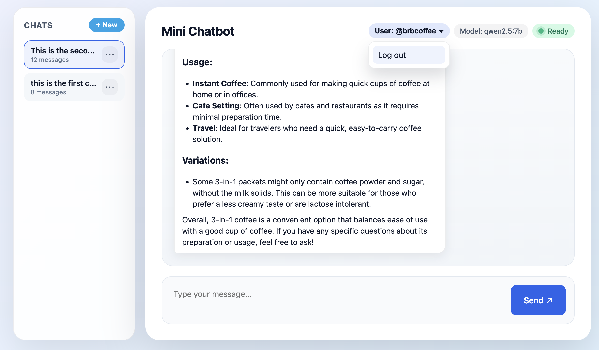

# User System Design

## Problem To Solve
- **Volatile chats** – the initial app stored conversations entirely in browser `localStorage`, so refreshing or switching devices lost every message and the backend could not rebuild history before calling Ollama.
- **No identity model** – without user IDs, the server had no way to isolate sessions per person, so persisting history or supporting multiple chats per user was impossible.
- **Manual context** – `/api/chat` trusted whatever `messages[]` the browser sent, meaning a malicious client could spoof someone else’s conversation or overload the model with arbitrarily long prompts.

The new user system keeps authoritative history in the backend, lets each person pick a memorable handle, and lets the server reconstruct session context safely on every request.

## Architecture

### Component Overview
```
┌───────────┐      HTTPS       ┌──────────────┐      HTTP keep-alive      ┌───────────┐
│  Browser  │ ───────────────► │ Express API  │ ────────────────────────► │  Ollama   │
│ (Frontend)│ ◄─────────────── │   server.js  │ ◄──────────────────────── │   LLM     │
└───────────┘  streams NDJSON  └──────────────┘    streaming tokens       └───────────┘
         │                                │
         │                                │ SQLite WAL + prepared statements
         │                                ▼
         │                       ┌────────────────┐
         └──────────────────────►│ chat.sqlite DB │
      session requests (REST)    └────────────────┘
```

- Browser: prompts for a username, lists sessions, and sends `/api/chat` with `{ userId, sessionId, content }`. Streams LLM deltas back to the UI.
- Express API: validates ownership, loads/saves conversations, proxies streaming requests to Ollama with keep-alive agents and abort support, and exposes CRUD endpoints for users and sessions.
- SQLite (via `better-sqlite3`): stores three tables (`users`, `sessions`, `messages`) with foreign keys, indexes, and WAL for concurrent reads/writes.
- Ollama LLM endpoint: receives full conversation context from the API server and streams generated tokens back over HTTP.

### Chat Request Sequence
```
User types message
  ↓
frontend → POST /api/chat { userId, sessionId, content }
  ↓ validates session ownership
server → SELECT messages WHERE session_id = ?
  ↓ append user message, auto-title session if needed
server → POST to Ollama (keep-alive agent, AbortController)
  ↓ stream deltas to browser, accumulate assistant text
server → INSERT assistant message, touch session timestamp
```

## Key Technical Decisions
- **SQLite + `better-sqlite3`**: chosen for its zero-config deployment, synchronous prepared statements, and WAL/foreign-key support. Perfect for a toy app yet still durable enough to keep chat history across restarts.
- **Normalized schema**: `users` (UUID + unique username), `sessions` (per-user chats with `updated_at` index), and `messages` (ordered by `created_at`). This makes listing sessions, loading history, and pruning conversations straightforward.
- **Backend-owned history**: `/api/chat` reconstructs prompts server-side, so Ollama only sees verified context. Prevents spoofing, lets us prune/summarize later, and allows persistence across devices.
- **Abort + keep-alive reuse**: carried over from earlier optimization to ensure upstream requests end when clients disconnect and to reuse sockets for smoother concurrency.
- **Frontend synchronization**: SPA now bootstraps by claiming/creating a username, fetching sessions, lazy-loading messages, and persisting only lightweight identifiers (`userId`, `activeSession`) locally. Auto titling and rename/delete actions call the REST endpoints to keep server and UI in sync.

## Screenshots
User login 


User logout
